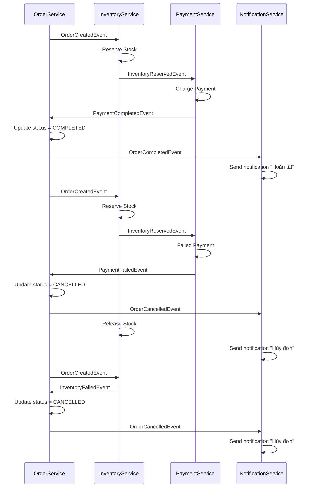

---
title: "Bài 10: Hiểu và áp dụng Saga Pattern trong Microservices (Choreography Saga)"
description: "Hiểu cách Saga Pattern giải quyết distributed transaction trong microservices, từ luồng đặt hàng thực tế đến cách triển khai choreography saga với order-service, inventory-service, payment-service và notification-service."
pubDate: 2025-08-09
category: "Microservices"
image: "/images/microservices/bai-10.png"
---


## 1. Vấn đề đặt ra

Trong **monolithic application**:

* một transaction có thể thao tác trên nhiều bảng trong cùng một cơ sở dữ liệu
* nếu một bước thất bại thì toàn bộ transaction rollback
* dữ liệu được đảm bảo tính **ACID**

Trong **microservices**:

* mỗi service sở hữu cơ sở dữ liệu riêng
* một nghiệp vụ thực tế như **đặt hàng** thường cần sự phối hợp của nhiều service:
  * **Order Service** tạo đơn hàng
  * **Inventory Service** kiểm tra và trừ tồn kho
  * **Payment Service** xử lý thanh toán
  * **Notification Service** gửi email hoặc SMS cho khách
* không còn một transaction toàn cục bao trùm tất cả service, nên không thể áp dụng trực tiếp ACID như trong monolith

Bài toán đặt ra:

* đặt hàng nhưng hết hàng thì đơn hàng phải bị huỷ
* thanh toán thất bại thì đơn phải rollback về mặt business logic
* nếu mọi thứ thành công thì cập nhật trạng thái đơn và thông báo cho khách

---

## 2. Transaction Pattern trong Microservices

Để xử lý distributed transaction, có nhiều cách tiếp cận. Trong đó:

* **2PC (two-phase commit)**: khó scale, ít dùng trong microservices
* **Saga Pattern**: giải pháp phổ biến, đảm bảo **eventual consistency**


---

## 3. Saga Pattern là gì?

**Saga Pattern** là cách chia một giao dịch lớn thành nhiều **local transaction**.

* mỗi service chỉ quản lý database của nó
* sau khi commit local transaction, service phát event cho service kế tiếp
* nếu có lỗi, hệ thống chạy **compensating action** để undo business step trước đó

Có 2 style phổ biến:

* **Choreography**: các service trao đổi event trực tiếp với nhau
* **Orchestration**: có một service hoặc workflow engine đứng giữa để điều phối

---

## 4. Luồng thực tế của Choreography Saga


---

## 5. Khi nào dùng Choreography, khi nào Orchestration?

### Choreography

* nghiệp vụ đơn giản, ít service
* event-driven là cách diễn đạt tự nhiên của luồng nghiệp vụ

### Orchestration

* luồng phức tạp, nhiều nhánh
* cần quản lý tập trung
* thường dùng engine như **Camunda**, **Temporal**, **Conductor**

---

## 6. Kết luận ngắn gọn

Saga Pattern là giải pháp thực tế để xử lý distributed transaction trong microservices.

* tránh dùng 2PC trong phần lớn hệ thống microservices
* chấp nhận **eventual consistency**
* phù hợp với e-commerce, banking, logistics, booking system

Luồng đặt hàng trong bài này là ví dụ **Choreography Saga**. Ở bước nâng cao hơn, bạn có thể thử **Orchestration Saga** với Camunda hoặc Temporal để quan sát luồng dễ hơn.

**Exercise:** hãy thử thêm case **Refund Payment** khi đơn hàng bị hủy. Đó chính là một ví dụ thực tế của **compensating action**.

---

## 7. Luồng nghiệp vụ tổng quát


> Các bạn copy code này bỏ vào mermaid chart để xem luồng nhé

## 8. Giải thích luồng nghiệp vụ đặt hàng

### B1. Tạo đơn hàng

* **OrderService** tạo đơn mới với trạng thái `PENDING`
* publish `OrderCreatedEvent`

### B2. Kiểm tra tồn kho

* **InventoryService** consume event
* nếu đủ hàng thì reserve stock và publish `InventoryReservedEvent`
* nếu hết hàng thì publish `InventoryFailedEvent`, sau đó `OrderService` hủy đơn

### B3. Thanh toán

* **PaymentService** consume `InventoryReservedEvent`
* nếu thanh toán thành công:
  * publish `PaymentCompletedEvent`
  * `OrderService` update `COMPLETED`
  * `OrderService` publish `OrderCompletedEvent`
  * `NotificationService` gửi thông báo thành công
* nếu thanh toán thất bại:
  * publish `PaymentFailedEvent`
  * `OrderService` update `CANCELLED`
  * `OrderService` publish `OrderCancelledEvent`
  * `InventoryService` consume `OrderCancelledEvent` và release stock
  * `NotificationService` gửi thông báo hủy đơn

---

## 9. Điểm quan trọng của choreography

Điểm quan trọng nhất ở đây là:

* `OrderService` **không trực tiếp** gọi `InventoryService` để trả hàng
* thay vào đó, `OrderService` publish `OrderCancelledEvent`
* `InventoryService` subscribe event đó và tự chạy compensating transaction

Đây là cách **Saga choreography** giữ cho hệ thống nhất quán về mặt business mà không cần global transaction.

---

## 10. Tóm tắt Saga flow

1. `OrderService` tạo đơn với trạng thái `PENDING`
2. `InventoryService` reserve stock, nếu fail thì order bị `CANCELLED`
3. `PaymentService` charge payment, nếu fail thì order bị `CANCELLED` và release stock
4. nếu tất cả thành công thì order chuyển sang `COMPLETED`
5. `NotificationService` gửi thông báo cho khách

---

## 11. Ưu và nhược điểm của choreography trong luồng này

### Ưu điểm

* đơn giản, dễ quan sát bằng log
* loose coupling
* dễ scale độc lập theo từng service
* phù hợp với event-driven architecture

### Nhược điểm

* khó quan sát toàn cảnh nếu không có tracing
* khó kiểm soát khi luồng phức tạp
* compensating transaction dễ bị thiếu hoặc sai
* khó test end-to-end
* độ trễ cao hơn vì event phải đi qua broker

### Kết luận

* **Choreography Saga** phù hợp với luồng đơn giản, ít service
* **Orchestration Saga** phù hợp với luồng nhiều nhánh, nhiều bước, nhiều trạng thái

---

## 12. Bắt đầu với `inventory-service` viết bằng Golang

Clone:

* HTTPS: `https://github.com/Gianguyen1234/inventory-service-golang.git`
* SSH: `git@github.com:Gianguyen1234/inventory-service-golang.git`

Nhớ tạo bảng `inventory`:

```sql
CREATE TABLE Inventory (
    product_id INT NOT NULL PRIMARY KEY,
    quantity INT NOT NULL
);
```

---

## 13. Tạo `payment-service`

### 1. Cấu trúc Payment Service

```text
payment-service/
  src/main/java/com/example/payment/
    service/
      PaymentService.java
      KafkaProducerService.java
    consumer/
      InventoryEventConsumer.java
    model/
      events/
        InventoryReservedEvent.java
        PaymentCompletedEvent.java
        PaymentFailedEvent.java
    PaymentServiceApplication.java
  pom.xml
```

### 2. Event model

`InventoryReservedEvent.java`

```java
@Data
@NoArgsConstructor
@AllArgsConstructor
public class InventoryReservedEvent {
    private Long orderId;
    private String status;
    private String message;
}
```

`PaymentCompletedEvent.java`

```java
import lombok.AllArgsConstructor;
import lombok.Data;
import lombok.NoArgsConstructor;

@Data
@AllArgsConstructor
@NoArgsConstructor
public class PaymentCompletedEvent {
    private Long orderId;
    private String paymentId;
    private double amount;
}
```

### 3. Consume `InventoryReservedEvent`

`InventoryEventConsumer.java`

```java
@Service
@RequiredArgsConstructor
public class InventoryEventConsumer {
    private final PaymentService paymentService;

    @KafkaListener(topics = "inventory-reserved", groupId = "payment-service")
    public void handleInventoryReserved(InventoryReservedEvent event) {
        System.out.printf("PaymentService nhận được InventoryReservedEvent: orderId=%d, status=%s, message=%s%n",
            event.getOrderId(), event.getStatus(), event.getMessage());

        paymentService.processPayment(event);
    }
}
```

### 4. Payment service

`PaymentService.java`

```java
import org.springframework.stereotype.Service;

import java.util.UUID;

@Service
@RequiredArgsConstructor
public class PaymentService {
    private final KafkaProducerService kafkaProducerService;

    public void processPayment(InventoryReservedEvent event) {
        try {
            boolean success = Math.random() > 0.2;

            if (success) {
                PaymentCompletedEvent completed = new PaymentCompletedEvent();
                completed.setOrderId(event.getOrderId());
                completed.setPaymentId(UUID.randomUUID().toString());
                completed.setAmount(100.0);

                kafkaProducerService.sendPaymentCompleted(completed);
                System.out.println("Payment success -> gửi PaymentCompletedEvent");
            }
        } catch (Exception e) {
            e.printStackTrace();
        }
    }
}
```

### 5. Kafka producer

`KafkaProducerService.java`

```java
import lombok.RequiredArgsConstructor;
import org.springframework.kafka.core.KafkaTemplate;
import org.springframework.stereotype.Service;

@Service
@RequiredArgsConstructor
public class KafkaProducerService {
    private final KafkaTemplate<String, Object> kafkaTemplate;

    private static final String TOPIC_PAYMENT_COMPLETED = "payments";
    private static final String TOPIC_PAYMENT_FAILED = "payments_failed";

    public void sendPaymentCompleted(PaymentCompletedEvent event) {
        kafkaTemplate.send(TOPIC_PAYMENT_COMPLETED, String.valueOf(event.getOrderId()), event);
    }

    public void sendPaymentFailed(PaymentFailedEvent event) {
        kafkaTemplate.send(TOPIC_PAYMENT_FAILED, String.valueOf(event.getOrderId()), event);
    }
}
```

### 6. `application.yml`

```yaml
server:
  port: 8087

spring:
  kafka:
    bootstrap-servers: localhost:9092

    consumer:
      group-id: payment-service
      auto-offset-reset: earliest
      key-deserializer: org.apache.kafka.common.serialization.StringDeserializer
      value-deserializer: org.springframework.kafka.support.serializer.ErrorHandlingDeserializer
      properties:
        spring.deserializer.value.delegate.class: org.springframework.kafka.support.serializer.JsonDeserializer
        spring.json.trusted.packages: "*"
        spring.json.value.default.type: com.example.paymentservicetest.model.events.InventoryReservedEvent

    producer:
      key-serializer: org.apache.kafka.common.serialization.StringSerializer
      value-serializer: org.springframework.kafka.support.serializer.JsonSerializer
      properties:
        spring.json.add.type.headers: false
```

---

## 14. Cập nhật `order-service`

### 1. Bổ sung field cho `Order`

```java
package com.example.orderservice.model;

import jakarta.persistence.*;
import lombok.*;

@Entity
@Table(name = "orders")
@Data
@NoArgsConstructor
@AllArgsConstructor
@Builder
public class Order {
    @Id
    @GeneratedValue(strategy = GenerationType.IDENTITY)
    private Long id;

    private Long userId;
    private String product;
    private Double price;
    private Long productId;
    private int quantity;
    private Double total;

    @Enumerated(EnumType.STRING)
    private OrderStatus status;
}
```

### 2. `OrderStatus`

```java
package com.example.orderservice.model;

public enum OrderStatus {
    PENDING,
    COMPLETED,
    CANCELLED
}
```

### 3. Event tổng hợp cho `OrderService`

* **producer events**
  * `OrderCreatedEvent`
  * `OrderCompletedEvent`
  * `OrderCancelledEvent`
* **consumer events**
  * `InventoryFailedEvent`
  * `PaymentCompletedEvent`
  * `PaymentFailedEvent`

`OrderCreatedEvent.java`

```java
import lombok.Data;

@Data
public class OrderCreatedEvent {
    private Long orderId;
    private Long userId;
    private Long productId;
    private int quantity;
    private double total;
}
```

`OrderCompletedEvent.java`

```java
import lombok.AllArgsConstructor;
import lombok.Data;
import lombok.NoArgsConstructor;

@Data
@AllArgsConstructor
@NoArgsConstructor
public class OrderCompletedEvent {
    private Long orderId;
    private Long userId;
    private String status;
}
```

`PaymentCompletedEvent.java`

```java
import lombok.Data;

@Data
public class PaymentCompletedEvent {
    private Long orderId;
    private String paymentId;
    private double amount;
}
```

## 15. Ghi chú quan trọng

Trong các snippet consumer của `order-service`, khi nhận event từ inventory hoặc payment thì trạng thái cuối cùng nên map về enum hiện có:

* inventory fail -> `CANCELLED`
* payment completed -> `COMPLETED`
* payment failed -> `CANCELLED`

Không nên dùng các status như `INVENTORY_FAILED` hoặc `PAYMENT_COMPLETED` nếu enum `OrderStatus` của bạn chưa khai báo các giá trị đó.

---

## 16. Tổng kết

Saga Pattern theo kiểu choreography cho bạn một cách triển khai distributed transaction thực tế trong microservices:

* mỗi service tự xử lý local transaction của nó
* giao tiếp bằng event
* khi có lỗi thì dùng compensating action thay vì rollback global transaction

Điểm quan trọng nhất không nằm ở Kafka hay framework, mà nằm ở việc:

* xác định đúng event nào là source of truth
* thiết kế compensating action đủ chặt
* xử lý được duplicate event, retry, và idempotency

Nếu luồng nghiệp vụ của bạn bắt đầu có quá nhiều event và khó theo dõi, đó là lúc nên cân nhắc chuyển sang **Orchestration Saga**.
