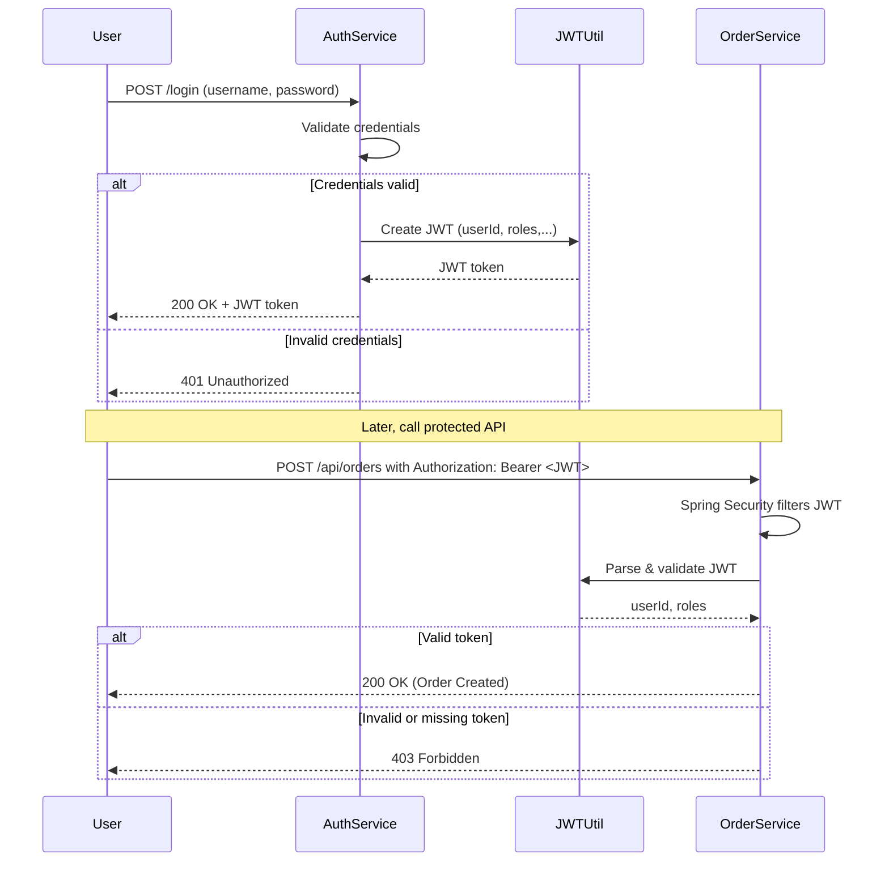
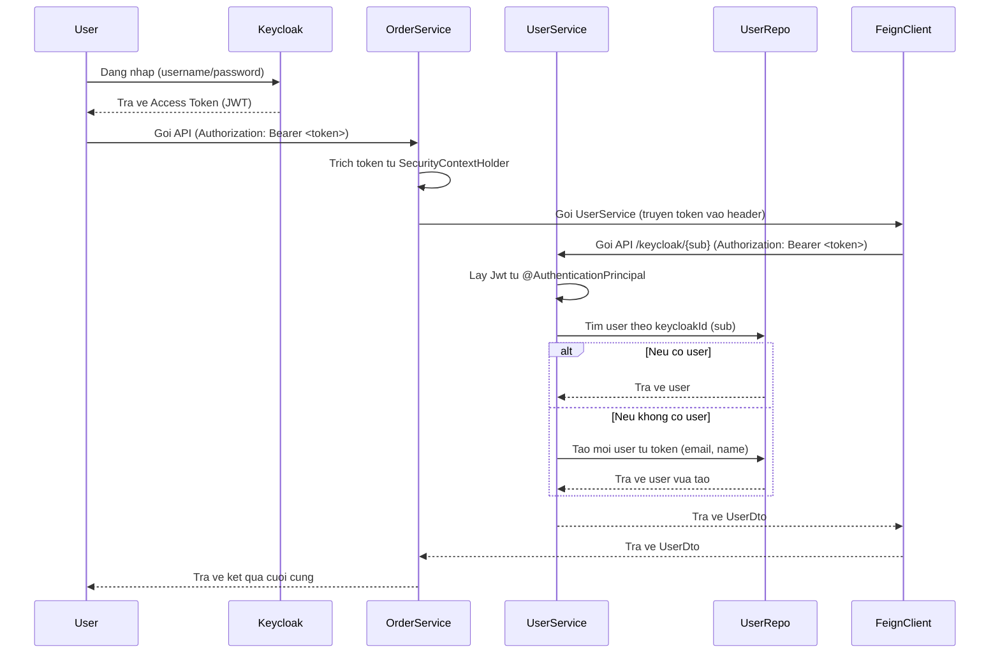

## 1. Mục đích của Authentication là gì?

Authentication là quá trình xác thực danh tính của người dùng.

> Một request đến server: của ai, và được phép làm gì?

Server cần có cách để kiểm tra danh tính của người gửi request, ví dụ:

- có phải là `userA` đã đăng nhập hay không
- có đúng là `admin` hay không

---

## 2. Các phương pháp xác thực

| Phương pháp | Cách hoạt động | Ưu điểm | Nhược điểm |
| --- | --- | --- | --- |
| **Session-based** | Sau khi login, server lưu session và gắn `sessionId` trong cookie | Dễ triển khai | Không phù hợp cho microservices, khó scale |
| **JWT (JSON Web Token)** | Sau khi login, server trả về token chứa thông tin người dùng, client gửi lại trong mỗi request | Stateless, không cần lưu session | Token có thể bị lộ nếu lưu không an toàn |
| **OAuth2 / OpenID Connect** | Dùng bên thứ ba để xác thực | Chuẩn hóa, dễ mở rộng | Cần thêm công cụ hoặc dịch vụ ngoài |
| **Keycloak** | Identity Provider hỗ trợ OAuth2 / OIDC / SAML | Full tính năng SSO, phân quyền, quản lý user | Nặng hơn, phải học thêm |

## 3. JWT là gì? Dùng để làm gì?

JWT là một token dạng text, ví dụ:

```text
eyJhbGciOiJIUzI1NiIsInR5cCI6IkpXVCJ9...
```

Trong JWT có thể chứa thông tin như:

```json
{
  "sub": "user123",
  "role": "admin",
  "exp": 1723456000
}
```

### Dùng JWT khi nào?

- khi bạn không muốn lưu session trên server
- khi làm API, đặc biệt là microservices
- khi cần mang theo thông tin người dùng mà không gọi lại `user-service`

## 4. Luồng JWT cơ bản

### Login và nhận token

```http
POST /api/login
-> Server xác thực username/password
-> Trả về JWT chứa thông tin user
```

### Gửi request sau đó

```http
GET /api/orders
Authorization: Bearer <JWT>
-> Server đọc token -> xác định userId
```

Server không cần lưu trạng thái phiên, vì thông tin đã nằm trong token.

---

## 5. Vậy Keycloak là gì?

Keycloak là một dịch vụ chuyên để xác thực người dùng:

- hỗ trợ login, đăng ký, đổi mật khẩu, quên mật khẩu
- hỗ trợ OAuth2, OpenID Connect, SAML
- có UI để quản lý user, role, permission
- có thể kết nối Google, Facebook, LDAP

Nó giống như một auth center, nghĩa là bạn không cần tự viết toàn bộ login/register nữa.

---

## 6. Hệ thống lớn thì dùng cái nào?

| Kiến trúc hệ thống | Phù hợp dùng gì |
| --- | --- |
| Website nhỏ, ít người dùng | Session-based |
| REST API, SPA, Mobile app | JWT hoặc OAuth2 |
| Hệ thống lớn, đa dịch vụ | Keycloak, OAuth2, OpenID Connect |
| Dự án cần Single Sign-On | Keycloak, Auth0, Okta |

Việc chọn phụ thuộc vào:

- nhu cầu chức năng
- kiểu kiến trúc
- chi phí
- năng lực đội ngũ

## Tóm tắt nhanh

- **JWT** là cách xác thực kiểu "tự mang chứng minh thư đi khắp nơi"
- **Keycloak** là dịch vụ chuyên lo chuyện đăng nhập, xác thực và cấp token
- nhiều phương pháp tồn tại vì nhiều bối cảnh sử dụng khác nhau

---

# Mục tiêu: Spring Security + JWT

| Service | Mục tiêu bảo vệ |
| --- | --- |
| `user-service` | Login và trả về JWT |
| `order-service` | Yêu cầu JWT trong header để tạo đơn hàng |

## Các bước thực hiện

### 1. Thêm thư viện JWT vào `user-service` và `order-service`

```plaintext
implementation 'org.springframework.boot:spring-boot-starter-security'
implementation 'io.jsonwebtoken:jjwt-api:0.11.5'
runtimeOnly 'io.jsonwebtoken:jjwt-impl:0.11.5'
runtimeOnly 'io.jsonwebtoken:jjwt-jackson:0.11.5'
```

### 2. Viết `JwtService` để tạo và xác thực token trong `user-service`

```java
import com.example.userservice.model.User;
import io.jsonwebtoken.Claims;
import io.jsonwebtoken.Jwts;
import io.jsonwebtoken.SignatureAlgorithm;
import io.jsonwebtoken.security.Keys;
import org.springframework.stereotype.Service;

import java.util.Date;

@Service
public class JwtService {

    private static final String SECRET_KEY = "my-very-long-and-secure-jwt-secret-key-123456";

    public String generateToken(User user) {
        return Jwts.builder()
                .setSubject(user.getEmail())
                .claim("userId", user.getId())
                .setIssuedAt(new Date())
                .setExpiration(new Date(System.currentTimeMillis() + 86400000))
                .signWith(Keys.hmacShaKeyFor(SECRET_KEY.getBytes()), SignatureAlgorithm.HS256)
                .compact();
    }

    public Claims extractClaims(String token) {
        return Jwts.parserBuilder()
                .setSigningKey(SECRET_KEY.getBytes())
                .build()
                .parseClaimsJws(token)
                .getBody();
    }

    public boolean isTokenValid(String token) {
        return extractClaims(token).getExpiration().after(new Date());
    }

    public Long extractUserId(String token) {
        return extractClaims(token).get("userId", Long.class);
    }
}
```

### 3. Tạo `AuthController` để login/register trong `user-service`

```java
import com.example.userservice.model.User;
import com.example.userservice.repository.UserRepository;
import com.example.userservice.services.JwtService;
import lombok.RequiredArgsConstructor;
import org.springframework.http.HttpStatus;
import org.springframework.http.ResponseEntity;
import org.springframework.security.crypto.bcrypt.BCryptPasswordEncoder;
import org.springframework.web.bind.annotation.*;
import org.springframework.web.server.ResponseStatusException;

import java.util.Map;

@RestController
@RequiredArgsConstructor
@RequestMapping("/api/auth")
public class AuthController {

    private final UserRepository userRepo;
    private final JwtService jwtService;
    private final BCryptPasswordEncoder passwordEncoder;

    @PostMapping("/login")
    public ResponseEntity<?> login(@RequestBody Map<String, String> body) {
        String email = body.get("email");
        String password = body.get("password");

        User user = userRepo.findByEmail(email)
                .orElseThrow(() -> new ResponseStatusException(HttpStatus.UNAUTHORIZED, "Invalid credentials"));

        if (!passwordEncoder.matches(password, user.getPassword())) {
            throw new ResponseStatusException(HttpStatus.UNAUTHORIZED, "Invalid credentials");
        }

        String token = jwtService.generateToken(user);
        return ResponseEntity.ok(Map.of("token", token));
    }

    @PostMapping("/register")
    public ResponseEntity<?> register(@RequestBody Map<String, String> body) {
        String email = body.get("email");
        String password = body.get("password");
        String name = body.get("name");

        if (userRepo.findByEmail(email).isPresent()) {
            throw new ResponseStatusException(HttpStatus.BAD_REQUEST, "Email already in use");
        }

        User newUser = new User();
        newUser.setEmail(email);
        newUser.setPassword(passwordEncoder.encode(password));
        newUser.setName(name);

        userRepo.save(newUser);

        String token = jwtService.generateToken(newUser);
        return ResponseEntity.ok(Map.of("token", token));
    }
}
```

### 4. Cấu hình bảo mật với Spring Security trong `user-service`

```java
import org.springframework.context.annotation.Bean;
import org.springframework.context.annotation.Configuration;
import org.springframework.security.config.annotation.web.builders.HttpSecurity;
import org.springframework.security.config.annotation.web.configurers.AbstractHttpConfigurer;
import org.springframework.security.crypto.bcrypt.BCryptPasswordEncoder;
import org.springframework.security.web.SecurityFilterChain;

@Configuration
public class SecurityConfig {

    @Bean
    public SecurityFilterChain filterChain(HttpSecurity http) throws Exception {
        return http
                .csrf(AbstractHttpConfigurer::disable)
                .authorizeHttpRequests(auth -> auth
                        .requestMatchers("/api/auth/**").permitAll()
                        .anyRequest().authenticated()
                )
                .build();
    }

    @Bean
    public BCryptPasswordEncoder passwordEncoder() {
        return new BCryptPasswordEncoder();
    }
}
```

### 5. Bảo vệ API bằng Spring Security trong `order-service`

#### `SecurityConfig.java`

```java
import com.example.orderservice.middleware.JwtAuthFilter;
import org.springframework.context.annotation.Bean;
import org.springframework.context.annotation.Configuration;
import org.springframework.security.config.annotation.web.builders.HttpSecurity;
import org.springframework.security.config.annotation.web.configuration.EnableWebSecurity;
import org.springframework.security.config.annotation.web.configurers.AbstractHttpConfigurer;
import org.springframework.security.web.SecurityFilterChain;
import org.springframework.security.web.authentication.UsernamePasswordAuthenticationFilter;

@Configuration
@EnableWebSecurity
public class SecurityConfig {

    @Bean
    public SecurityFilterChain filterChain(HttpSecurity http) throws Exception {
        return http
                .csrf(AbstractHttpConfigurer::disable)
                .authorizeHttpRequests(auth -> auth
                        .requestMatchers("/api/orders/**").authenticated()
                        .anyRequest().permitAll())
                .addFilterBefore(jwtAuthFilter(), UsernamePasswordAuthenticationFilter.class)
                .build();
    }

    @Bean
    public JwtAuthFilter jwtAuthFilter() {
        return new JwtAuthFilter();
    }
}
```

### 6. Middleware `JwtAuthFilter.java` trong `order-service`

```java
import io.jsonwebtoken.Claims;
import io.jsonwebtoken.Jwts;
import java.io.IOException;
import jakarta.servlet.FilterChain;
import jakarta.servlet.ServletException;
import jakarta.servlet.http.HttpServletRequest;
import jakarta.servlet.http.HttpServletResponse;
import org.springframework.lang.NonNull;
import org.springframework.security.authentication.UsernamePasswordAuthenticationToken;
import org.springframework.security.core.context.SecurityContextHolder;
import org.springframework.web.filter.OncePerRequestFilter;

import java.util.List;

public class JwtAuthFilter extends OncePerRequestFilter {

    private static final String SECRET_KEY = "my-very-long-and-secure-jwt-secret-key-123456";

    @Override
    protected void doFilterInternal(@NonNull HttpServletRequest request,
                                    @NonNull HttpServletResponse response,
                                    @NonNull FilterChain filterChain) throws ServletException, IOException {

        String authHeader = request.getHeader("Authorization");

        if (authHeader == null || !authHeader.startsWith("Bearer ")) {
            filterChain.doFilter(request, response);
            return;
        }

        String token = authHeader.substring(7);
        Claims claims = Jwts.parserBuilder()
                .setSigningKey(SECRET_KEY.getBytes())
                .build()
                .parseClaimsJws(token)
                .getBody();

        Long userId = claims.get("userId", Long.class);

        UsernamePasswordAuthenticationToken auth =
                new UsernamePasswordAuthenticationToken(userId, null, List.of());

        SecurityContextHolder.getContext().setAuthentication(auth);
        filterChain.doFilter(request, response);
    }
}
```

### 7. Trong `OrderController`, lấy `userId` từ `SecurityContext`

```java
@PostMapping
public Order placeOrder(@RequestBody Order order) {
    Long userId = (Long) SecurityContextHolder.getContext().getAuthentication().getPrincipal();
    order.setUserId(userId);
    return orderService.createOrder(order);
}
```

## Lưu ý trong `api-gateway`

```yaml
server:
  port: 8080

spring:
  application:
    name: api-gateway

  cloud:
    gateway:
      routes:
        - id: user-service
          uri: lb://user-service
          predicates:
            - Path=/api/users/**

        - id: user-service-auth
          uri: lb://user-service
          predicates:
            - Path=/api/auth/**

        - id: order-service
          uri: lb://order-service
          predicates:
            - Path=/api/orders/**

eureka:
  client:
    service-url:
      defaultZone: http://localhost:8761/eureka/
```

## Cách test

1. Gọi `POST /api/auth/login` với email và password để nhận JWT

```json
{
  "name": "John Doe",
  "email": "john@example.com",
  "password": "123456"
}
```

2. Gửi `POST /api/orders`

```bash
curl -X POST http://localhost:8080/api/orders \
  -H "Content-Type: application/json" \
  -H "Authorization: Bearer YOUR_JWT_TOKEN_HERE" \
  -d '{
        "product": "Macbook Pro",
        "price": 2500.0,
        "total": 2500.0
      }'
```

3. Nếu không có JWT thì trả `403 Forbidden`

## Tổng kết phần JWT custom

- Spring Security bảo vệ API
- JWT xác thực người dùng và truyền `userId` cho `order-service`
- không cần gọi `user-service` để xác minh, vì token đã tự chứa thông tin cần thiết

---

# Keycloak

## Mục tiêu

- cấu hình Spring Security để tích hợp với Keycloak
- chỉ cho phép người dùng đã đăng nhập thông qua Keycloak được gọi API `/api/orders`

## Các bước chuẩn bị

### 1. Chạy Keycloak bằng Docker

```yaml
services:
  keycloak:
    image: quay.io/keycloak/keycloak:24.0.2
    container_name: keycloak
    command: start-dev
    ports:
      - "8080:8080"
    environment:
      KEYCLOAK_ADMIN: admin
      KEYCLOAK_ADMIN_PASSWORD: admin
```

### 2. Cấu hình realm, client và user

- tạo Realm: `demo-realm`
- tạo Client: `order-service`
  - Client Type: OpenID Connect
  - `confidential`
  - Client authentication: ON
  - Standard Flow Enabled: ON
- tạo User: `user1`, mật khẩu `123456`
- gán role nếu cần

**Import file hoàn chỉnh**

```json
{
  "realm": "demo-realm",
  "enabled": true,
  "clients": [
    {
      "clientId": "user-service",
      "enabled": true,
      "protocol": "openid-connect",
      "publicClient": false,
      "secret": "user-service-secret",
      "redirectUris": ["*"],
      "standardFlowEnabled": true,
      "directAccessGrantsEnabled": true
    }
  ],
  "users": [
    {
      "username": "user1",
      "email": "holyne@gmail.com",
      "enabled": true,
      "emailVerified": true,
      "credentials": [
        {
          "type": "password",
          "value": "123456",
          "temporary": false
        }
      ]
    }
  ]
}
```

## Spring Boot tích hợp với Keycloak

### 1. Thêm dependency

```plaintext
implementation 'org.springframework.boot:spring-boot-starter-oauth2-resource-server'
```

### 2. `application.yml`

```yaml
spring:
  security:
    oauth2:
      resource-server:
        jwt:
          issuer-uri: http://localhost:8080/realms/demo-realm
```

Spring Boot sẽ tự động lấy public key của Keycloak từ `.well-known/openid-configuration`.

## Cấu hình Security

```java
import org.springframework.context.annotation.Bean;
import org.springframework.context.annotation.Configuration;
import org.springframework.security.config.Customizer;
import org.springframework.security.config.annotation.web.builders.HttpSecurity;
import org.springframework.security.web.SecurityFilterChain;

@Bean
public SecurityFilterChain securityFilterChain(HttpSecurity http) throws Exception {
    return http
            .authorizeHttpRequests(auth -> auth
                    .requestMatchers("/api/orders").authenticated()
                    .anyRequest().permitAll()
            )
            .oauth2ResourceServer(resource -> resource
                    .jwt(Customizer.withDefaults())
            )
            .build();
}
```

## Tạo `FeignClientInterceptorConfig`

```java
package com.example.orderservice.config;

import feign.RequestInterceptor;
import org.springframework.context.annotation.Bean;
import org.springframework.context.annotation.Configuration;
import org.springframework.security.core.Authentication;
import org.springframework.security.core.context.SecurityContextHolder;
import org.springframework.security.oauth2.server.resource.authentication.JwtAuthenticationToken;

@Configuration
public class FeignClientInterceptorConfig {

    @Bean
    public RequestInterceptor requestInterceptor() {
        return requestTemplate -> {
            Authentication authentication = SecurityContextHolder.getContext().getAuthentication();
            if (authentication instanceof JwtAuthenticationToken jwtAuth) {
                String token = jwtAuth.getToken().getTokenValue();
                requestTemplate.header("Authorization", "Bearer " + token);
            }
        };
    }
}
```

## Tại `UserClient`

```java
@FeignClient(name = "user-service", configuration = FeignClientInterceptorConfig.class)
public interface UserClient {

    @GetMapping("/api/users/keycloak/{sub}")
    UserDto getUserByKeycloakId(@PathVariable("sub") String keycloakId);
}
```

## Update controller

```java
@RestController
@RequestMapping("/api/orders")
public class OrderController {

    @PostMapping
    public Order placeOrder(@RequestBody Order order, JwtAuthenticationToken auth) {
        String sub = auth.getToken().getSubject();
        UserDto user = userClient.getUserByKeycloakId(sub);

        order.setUserId(user.getId());
        return orderService.createOrder(order);
    }
}
```

## Bên `user-service`

Thêm trường này vào `User`:

```java
private String keycloakId;
```

Nhớ thêm OpenFeign dependency trong `build.gradle` của `user-service`.

## `UserService`: tự động import user từ Keycloak vào DB

```java
public User ensureUserExistsFromToken(Jwt jwt) {
    String keycloakId = jwt.getSubject();
    return userRepository.findByKeycloakId(keycloakId)
            .orElseGet(() -> {
                User user = new User();
                user.setKeycloakId(keycloakId);
                user.setEmail(jwt.getClaim("email"));
                user.setName(jwt.getClaim("preferred_username"));
                return userRepository.save(user);
            });
}
```

## Gọi trong controller

```java
@GetMapping("/keycloak/{sub}")
public UserDto getUserByKeycloakId(@PathVariable String sub, @AuthenticationPrincipal Jwt jwt) {
    User user = userRepository.findByKeycloakId(sub)
            .orElseGet(() -> userService.ensureUserExistsFromToken(jwt));

    return new UserDto(user.getId(), user.getName(), user.getEmail());
}
```

**Trong `UserRepository` nhớ thêm**

```java
Optional<User> findByKeycloakId(String keycloakId);
```

## Gửi đơn hàng

### Đăng nhập để lấy token từ Keycloak

```bash
curl -X POST http://localhost:8080/realms/demo-realm/protocol/openid-connect/token \
  -H "Content-Type: application/x-www-form-urlencoded" \
  -d "client_id=user-service" \
  -d "client_secret=YOUR_CLIENT_SECRET" \
  -d "username=user1" \
  -d "password=123456" \
  -d "grant_type=password"
```

### Dùng token đó để tạo đơn hàng

```bash
curl -X POST http://localhost:8080/api/orders \
  -H "Authorization: Bearer YOUR_ACCESS_TOKEN" \
  -H "Content-Type: application/json" \
  -d '{
        "product": "Macbook Pro",
        "price": 2500.0,
        "total": 2500.0
      }'
```

Nếu không có token thì `401 Unauthorized`.

Nếu token không hợp lệ thì `403 Forbidden`.

## Tổng thể luồng hoạt động

```plaintext
[Bước 1] Client đăng nhập Keycloak
    -> Gửi username/password đến Keycloak
    -> Nhận lại JWT (Access Token)

[Bước 2] Client gọi API đặt hàng đến Order-Service
    -> Gửi POST /api/orders
    -> Header: Authorization: Bearer <JWT>

[Bước 3] Order-Service xác thực token
    -> Spring Security tự động verify JWT bằng public key từ Keycloak
    -> Nếu hợp lệ, lưu JwtAuthenticationToken vào SecurityContext

[Bước 4] Order-Service lấy `sub` từ token
    -> Dùng auth.getToken().getSubject() -> sub

[Bước 5] Gọi sang User-Service bằng Feign Client
    -> GET /api/users/keycloak/{sub}
    -> Feign interceptor tự động gắn lại JWT vào header

[Bước 6] User-Service xác thực token từ header
    -> Spring Security trong user-service cũng verify JWT
    -> Nếu hợp lệ, giải mã ra claims

[Bước 7] User-Service kiểm tra DB
    -> Nếu tồn tại user có keycloakId = sub thì trả về user
    -> Nếu chưa có thì tạo mới user từ token

[Bước 8] Order-Service nhận được UserDto
    -> order.setUserId(user.getId())
    -> orderRepository.save(order)

[Bước 9] Trả về response tạo đơn hàng thành công cho Client
```

---

## Sequence diagram: JWT tự tạo vs Keycloak

### A. JWT tự tạo



### B. Dùng Keycloak



## So sánh nhanh: JWT tự tạo vs Keycloak

| Tiêu chí | JWT tự tạo | Keycloak |
| --- | --- | --- |
| Tự viết xác thực | Có | Không cần |
| Sinh token thủ công | Có | Keycloak sinh |
| Quản lý người dùng | Bạn tự làm | Có UI sẵn |
| Phân quyền, role | Tự code | Có sẵn |
| SSO / OAuth2 / OpenID Connect | Không hỗ trợ | Có |
| Phù hợp dự án | Nhỏ, đơn giản | Lớn, nhiều dịch vụ |
| Tốn công phát triển | Cao | Thấp hơn, nhưng phải học Keycloak |

## Kết luận

- Nếu bạn đang tự học hoặc làm project nhỏ, JWT custom là đủ
- Nếu hệ thống cần phân quyền rõ ràng, mở rộng tốt, hoặc SSO, Keycloak là hướng phù hợp hơn
